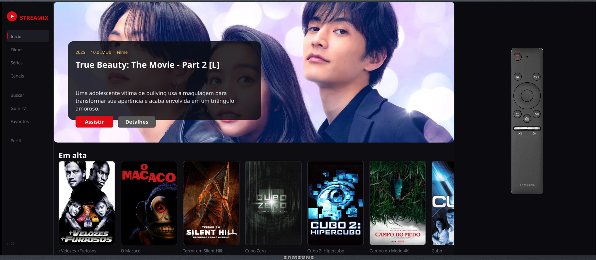
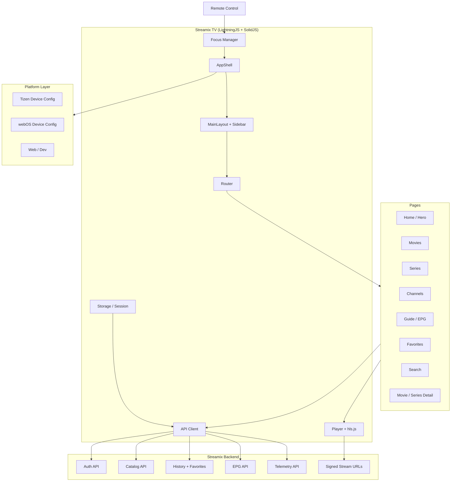
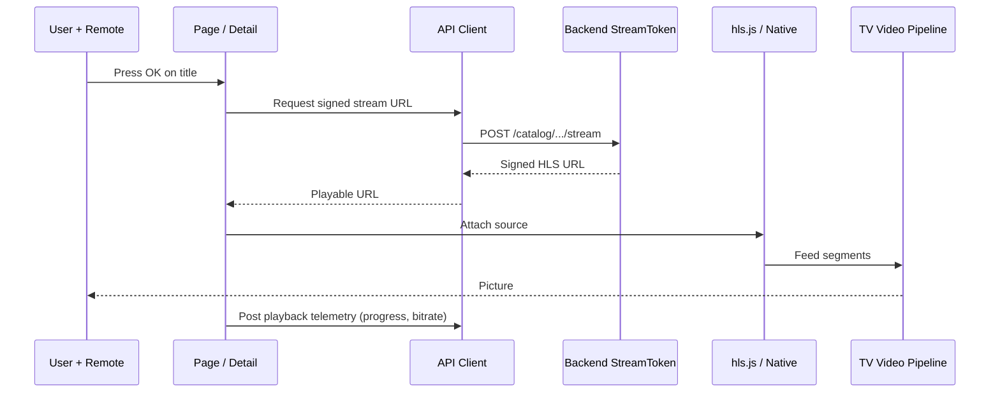

<h1 align="center">
  <br>
  
  <br>
  Streamix TV
  <br>
</h1>

<p align="center">
  <strong>A cinematic 10-foot streaming client built with LightningJS + SolidJS, targeting Samsung Tizen, LG webOS, Android TV, and Fire TV. The TV companion to the Streamix platform.</strong>
</p>

<p align="center">
  
  
  
  
  
  
  
  
  
  
</p>

<p align="center">
  
</p>

<p align="center">
  <a href="#sparkles-highlights">Highlights</a>&nbsp;&nbsp;&nbsp;|&nbsp;&nbsp;&nbsp;
  <a href="#art-architecture">Architecture</a>&nbsp;&nbsp;&nbsp;|&nbsp;&nbsp;&nbsp;
  <a href="#tv-runtime-surfaces">Runtime Surfaces</a>&nbsp;&nbsp;&nbsp;|&nbsp;&nbsp;&nbsp;
  <a href="#computer-stack">Stack</a>&nbsp;&nbsp;&nbsp;|&nbsp;&nbsp;&nbsp;
  <a href="#package-quick-start">Quick Start</a>&nbsp;&nbsp;&nbsp;|&nbsp;&nbsp;&nbsp;
  <a href="#memo-project-notes">Project Notes</a>
</p>

<br>

> [!NOTE]
> This repository contains only the Smart TV client. The Phoenix + LiveView backend, APIs, and web surface live in the
> [Streamix](https://github.com/gabrielmaialva33/streamix) repository.

## :sparkles: Highlights

### Native-feel TV Experience

- **10-foot UI** optimized for D-pad and remote navigation
- **WebGL rendering** via LightningJS for 60fps animations on low-power TV SoCs
- **Hero carousel, row-based browsing**, and cinematic focus transitions
- **Fast channel switching** with pre-buffered HLS streams
- **Exit dialog, skeleton loaders**, and scroll indicators tuned for TV ergonomics
- **MSDF fonts** (NotoSans with full PT-BR diacritics coverage) for crisp type on any screen

### Streamix-Connected

- **Auth** with session persistence in TV-local storage
- **Live TV, movies, and series** browsing with remote catalog paging
- **Favorites and watch history** synced with the backend, optimistic UI with rollback
- **Continue watching row** with server-side progress tracking
- **EPG now / next** for live channels
- **Semantic search** when the backend has Qdrant + Gemini configured
- **Playback telemetry** for bitrate, position, and error tracking

### Cross-Device Builds

- **Samsung Tizen** (`.wgt` packaging with certificate signing + `sdb` deploy)
- **LG webOS** build target
- **Android TV and Fire TV** via legacy-browser friendly Vite build
- **Device config plugin** that swaps polyfills and feature flags per target
- **Log server** over WebSocket for live debugging on TV hardware

## :fire: Why Streamix TV Feels Different

Streamix TV is not a wrapped web app running in a TV browser. It renders through WebGL with LightningJS, which means the
UI is a scene graph of textures rather than a DOM tree. Focus traversal, animations, and list virtualization are all
built for the constraints of TV hardware (limited GPU, slow CPU, remote latency).

The app is opinionated about what makes a good TV experience: no hover, no scroll, no hidden menus. Everything is
focus-driven, everything has a visible selection state, and every screen answers the "what can I press next" question
without guessing.

## :art: Architecture

### High-Level View



### Playback Flow



<details>
<summary><strong>Core modules worth knowing</strong></summary>

| Area             | Main modules                                                       |
| ---------------- | ------------------------------------------------------------------ |
| App shell        | `src/app/AppShell.tsx`, `src/app/bootstrap.tsx`, `routes.tsx`      |
| Layout + nav     | `src/app/MainLayout.tsx`, `src/components/Sidebar.tsx`             |
| Pages            | `src/pages/Home.tsx`, `Movies.tsx`, `Series.tsx`, `Guide.tsx`, ... |
| UI primitives    | `src/components/Card.tsx`, `Hero.tsx`, `Row.tsx`, `ExitDialog.tsx` |
| Player           | `src/features/player/` (hls.js integration, telemetry)             |
| Auth             | `src/features/auth/LoginPage.tsx`, `RequireAuth.tsx`               |
| API client       | `src/lib/api.ts`, `src/lib/storage.ts`                             |
| Device targeting | `devices/tizen/`, `devices/lg/`, `devices/common/`                 |
| Fonts            | `src/fonts.ts` (NotoSans MSDF)                                     |

</details>

## :tv: Runtime Surfaces

### Pages

- `/` home with hero + continue watching + curated rows
- `/login` session + register
- `/movies`, `/series`, `/channels`
- `/movies/:id`, `/series/:id` detail with cast, seasons, episodes
- `/guide` EPG now / next for live channels
- `/favorites`
- `/search` with semantic + fulltext
- `/player/:type/:id` full-screen playback

### Focus Model

- Sidebar is the root focus column; pages mount a `MainLayout` that forwards focus to their first row
- Rows implement horizontal D-pad traversal; columns implement vertical
- `ExitDialog` captures the back key on the home screen instead of closing the app blindly

## :computer: Stack

### Runtime

| Technology             | Version   | Role                                              |
| ---------------------- | --------- | ------------------------------------------------- |
| LightningJS Renderer   | `^3.0.1`  | WebGL scene graph and rendering                   |
| @lightningtv/solid     | `^3.1.18` | SolidJS bindings for Lightning                    |
| SolidJS                | `^1.9.12` | Reactive UI primitives                            |
| @solidjs/router        | `^0.16.1` | Client-side routing                               |
| hls.js                 | `^1.6.16` | Adaptive streaming in browsers without native HLS |
| @solid-primitives/i18n | `^2.2.1`  | Internationalization                              |

### Tooling

| Technology        | Role                                         |
| ----------------- | -------------------------------------------- |
| Vite 8            | Dev server, build, legacy target for old TVs |
| TypeScript 6      | Types across app, components, API            |
| ESLint + Prettier | Lint + format                                |
| Vitest            | Unit + browser tests via Playwright          |
| Storybook         | Isolated component development               |

### Target Platforms

| Platform      | Status    | Notes                                                     |
| ------------- | --------- | --------------------------------------------------------- |
| Samsung Tizen | supported | `.wgt` packaging, `sdb` install, certificate `StreamixTV` |
| LG webOS      | supported | `TARGET_DEVICE=lg` build                                  |
| Android TV    | supported | Chromium-based, legacy polyfills                          |
| Fire TV       | supported | Silk / WebView target                                     |
| Browser       | dev only  | Used for iteration via `pnpm start`                       |

## :package: Quick Start

### Prerequisites

- Node.js 20+
- pnpm 9+
- A running Streamix backend (see [Streamix repo](https://github.com/gabrielmaialva33/streamix))
- For Tizen: Tizen Studio CLI + certificate profile `StreamixTV`

### 1. Install

```bash
pnpm install
```

### 2. Configure environment

Create an `.env` based on `environments/` defaults. Typical values:

```dotenv
VITE_API_URL=https://your-streamix-host/api/v1
VITE_API_KEY=your-streamix-api-key
```

### 3. Run in the browser

```bash
pnpm start
```

Opens on [http://localhost:5173](http://localhost:5173) with hot reload. Arrow keys + Enter behave like a remote.

### 4. Deploy to Tizen (TV or emulator)

```bash
# Physical TV at 192.168.1.6
pnpm tizen:deploy

# Samsung emulator
pnpm tizen:deploy:emu
```

That pipeline runs `build:tizen` → `tizen:package` → `tizen:install` → `tizen:run`.

### 5. Live device logs

```bash
# Tizen kernel log
pnpm tizen:logs

# WebSocket log relay from the TV into your terminal
pnpm logs
```

<details>
<summary><strong>Device build matrix</strong></summary>

| Command                       | Target        | Output        |
| ----------------------------- | ------------- | ------------- |
| `pnpm build`                  | generic web   | `dist/`       |
| `pnpm build:tizen`            | Samsung Tizen | `dist/tizen/` |
| `TARGET_DEVICE=lg pnpm build` | LG webOS      | `dist/lg/`    |

</details>

## :wrench: Developer Commands

```bash
pnpm start              # dev server, browser
pnpm start:tizen        # dev server with Tizen polyfills
pnpm test               # vitest
pnpm tsc                # type-check only
pnpm lint               # eslint
pnpm lint-fix           # eslint --fix
pnpm format             # prettier --write
pnpm storybook          # component workbench
pnpm build:analyze      # bundle visualizer

pnpm tizen:install      # install last .wgt
pnpm tizen:run          # launch app on TV
pnpm tizen:kill         # kill app on TV
pnpm tizen:uninstall    # remove app from TV
```

## :memo: Project Notes

- The app is pinned to `@lightningtv/solid@3.1.18` because 3.2.x calls `animateProp`, which the pinned renderer `3.0.x`
  does not expose. Do not bump solid bindings without also bumping the renderer.
- MSDF fonts are required; the Tizen 4 Chromium (M56) cannot `fetch` `file://` URLs, so the font config uses relative
  URLs and registers NotoSans with explicit style/stretch descriptors.
- All code and comments are English-only; pt-BR is reserved for chat and commit messages.
- The signed stream URL returned by the backend requires `X-API-Key` on the final request; the player must inject it.
- Focus flow follows the `solid-demo-app` pattern: `App` → `MainLayout` → pages with a `forwardFocus` callback.

## :handshake: Contributing, License

- [AGENTS.md](AGENTS.md)
- [LICENSE](LICENSE)
- [NOTICE](NOTICE)

<br>

<p align="center">
  
</p>

<p align="center">
  Crafted by <strong>Gabriel Maia</strong><br>
  <a href="mailto:gabrielmaialva33@gmail.com">gabrielmaialva33@gmail.com</a> ·
  <a href="https://github.com/gabrielmaialva33">GitHub</a>
</p>
